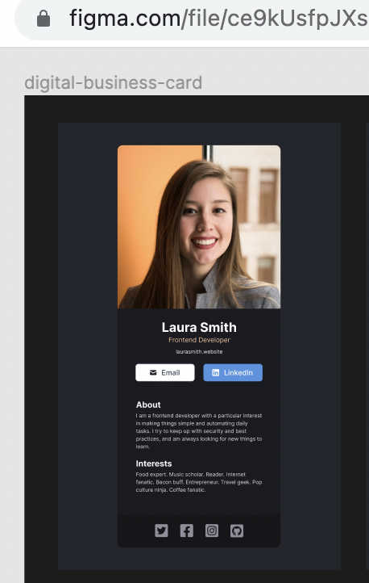
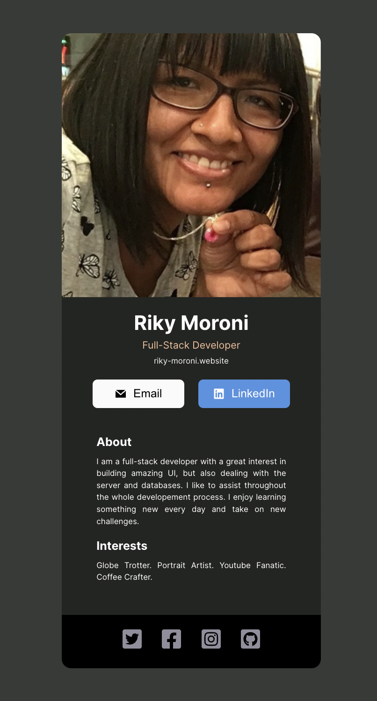

# React exercise-1 from Scrimba

Simple React exercise: build a digital business card following this figma design.

### My Solution

## Getting Started

This project was bootstrapped with [Create React App](https://github.com/facebook/create-react-app).

## Available Scripts

In the project directory, you can run:

### `npm start`

Runs the app in the development mode.\
Open [http://localhost:3000](http://localhost:3000) to view it in your browser.

### `npm test`

Launches the test runner in the interactive watch mode.\

I have fun working with React components. I spent like less than an hour building this. 😊

